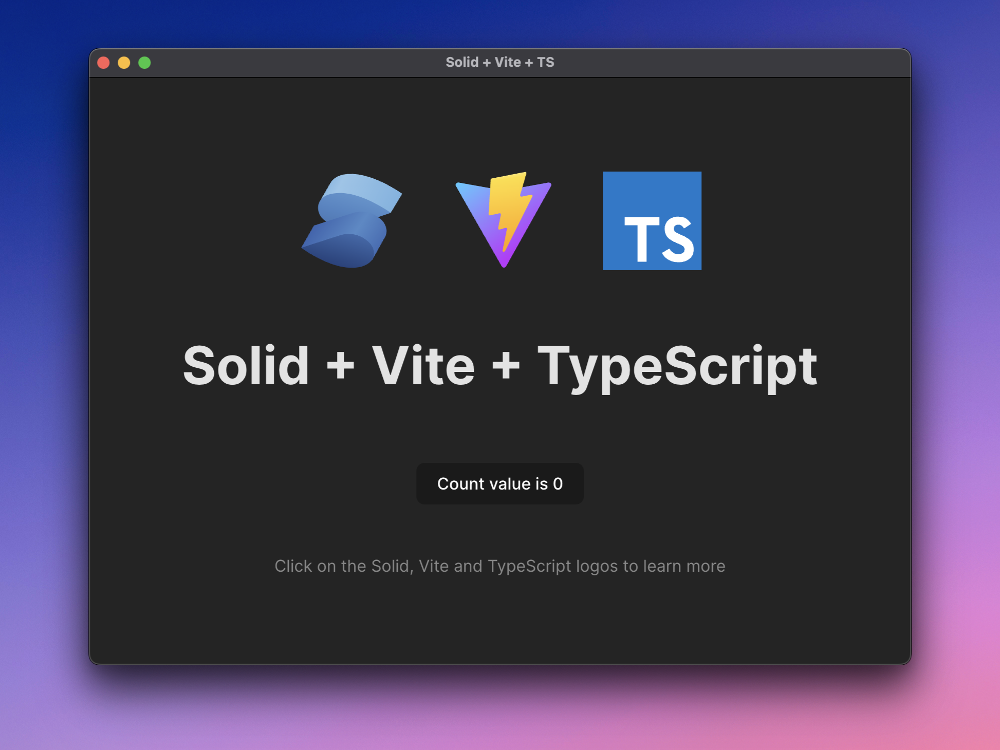

# solid-vite-electron



Inspired by [ch99q](https://github.com/ch99q/vite-solid-electron)

Based on [electron-vite](https://github.com/electron-vite/vite-plugin-electron/tree/main/examples/quick-start)

## Overview

⚡️ SolidJS + Vite + TypeScript + Electron

📦 Ready out of the box

🔥 Hot reloading

## Installation

```bash
# clone template without git history
npx degit https://github.com/tgrassl/solid-vite-electron <folder_name>

# open the project directory
cd <folder_name>

# install dependencies
npm install

# start the application
npm run dev

# make a production build
npm run build
```

## Directory structure

```tree
├── electron                                 Electron-related code
│   ├── main                                 Main-process source code
│   └── preload                              Preload-scripts source code
│
├── release                                  Generated after production build, contains executables
│   └── {version}
│       ├── {os}-{os_arch}                   Contains unpacked application executable
│       └── {app_name}_{version}.{ext}       Installer for the application
│
├── public                                   Static assets
└── src                                      Renderer source code, your SolidJS application
```

## Read more

[vite-plugin-electron](https://github.com/electron-vite/vite-plugin-electron)

[SolidJS](https://www.solidjs.com/)
